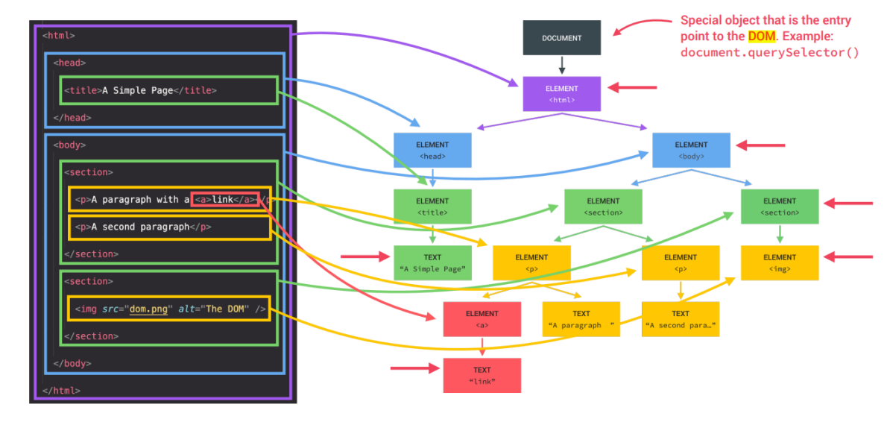

# What is DOM in JavaScript?
    DOCUMENT OBJECT MODEL: Structured representation of HTML documents.Allows JavaScript to access HTML elements and styles to manipulate them.

# DOM
According to the Document Object Model (DOM for short), every HTML tag is an object.
Subtags are "children" of the parent element. The text that is inside the tag is also an
object.All these objects are available with JavaScript, we can use them to modify the page.

    JavaScript can modify all HTML elements on a page.
    JavaScript can change all HTML attributes on a page.
    JavaScript can change all CSS styles on a page.
    JavaScript can remove existing HTML elements and attributes.
    JavaScript can add new HTML elements and attributes.
    JavaScript can respond to all existing HTML events on the page.
    JavaScript can fire new HTML events on a page

Definition and Usage. The querySelector() method returns the first child element that matches a
specified CSS selector(s) of an element, querySelectorAll() method can be used to access all elements
which match with a specified CSS selector.

# DOM Methods
innerHTML - Это свойство предоставляет простой способ полностью заменить содержимое элемента. Например, все содержимое элемента body может быть удалено: document.body.innerHTML = ""

The Style object represents an
individual style statement.
Element.style.color = "black"
Element.style.fontSize = ".5em"
Element.style.backgroundColor = "white"

# Html events
An HTML event can be something the
browser does, or something a user does.
Here are some examples of HTML events:
1. An HTML web page has finished loading
1. An HTML input field was changed
1. An HTML button was clicked

JavaScript lets you execute code when events are detected.

onclick - The user clicks an HTML element

# createElement()
    The JavaScript document.createElement() method allows you to create and return a
    new element (an empty Element node) with the specified tag name.

 createElement(elementName): Creates an html element whose tag is
passed as a parameter. Returns the created element

    

# HTML DOM Element appendChild()
    The appendChild() method appends a node (element) as the last
    child of an element.
    appendChild() adds a node to the end of the list of children of the
    specified parent node. If the given child element is a reference to
    an existing node in the document, then the appendChild()
    function moves it from its current position to the new position

    // Create a p element:
    const para = document.createElement("p");
    // Create a text node:
    const node = document.createTextNode("This is a paragraph.");
    // Append text node to the p element:
    para.appendChild(node);
    // Append the p element to the body:
    document.getElementById("myDIV").appendChild(para); 

# classlist()

    add( String [,String] )
    Adds the specified classes to the element

    remove( String [,String] )
    Removes the specified classes from the element

    toggle(String[, Boolean])
    If the element has no class, it adds it otherwise it removes it. When false is passed as the second parameter, it removes the specified class, and if true, it adds it.
